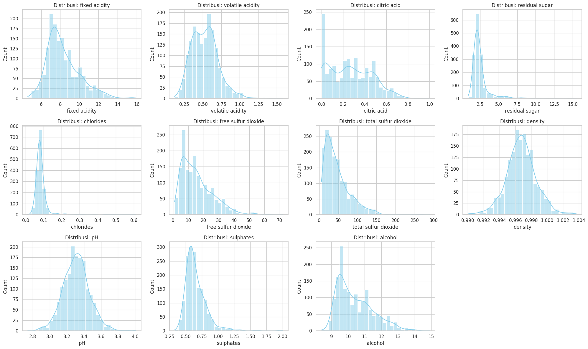
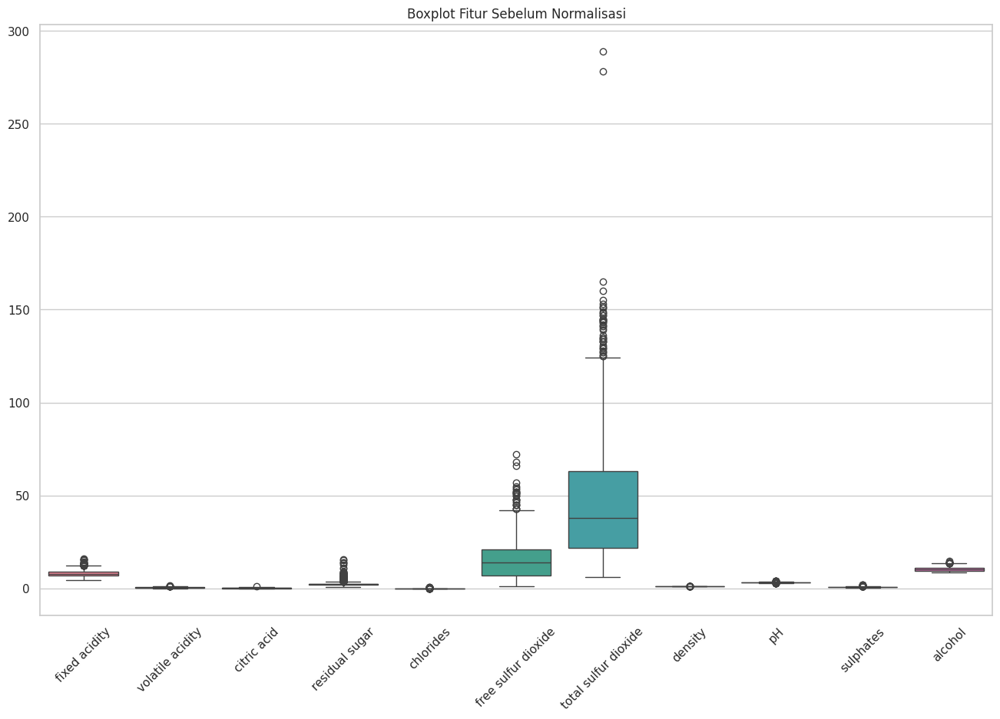
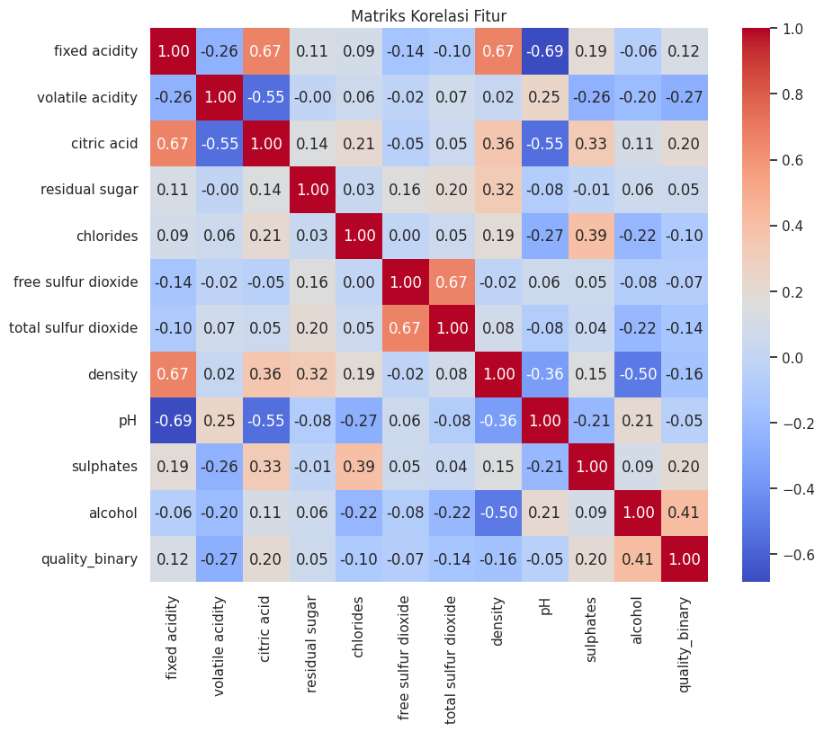
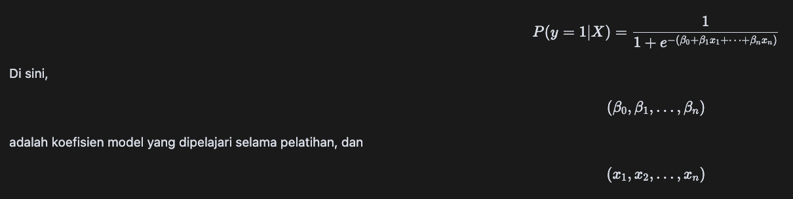
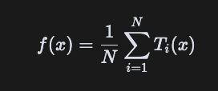
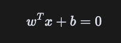
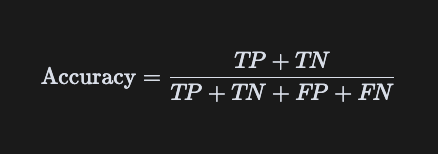
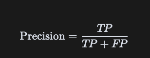
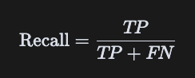
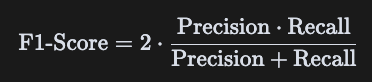

# Laporan Proyek Machine Learning - Gettar Adhi Pinaringan

## Domain Proyek

Kualitas anggur merupakan salah satu faktor utama yang menentukan nilai jual dan daya saing produk di industri wine. Penilaian kualitas secara konvensional biasanya dilakukan oleh panel ahli melalui proses pencicipan (tasting), yang bersifat subjektif, membutuhkan waktu, serta mahal dari segi biaya dan sumber daya manusia. Tantangan ini semakin besar ketika produsen harus mengelola volume produksi besar dengan tetap menjaga konsistensi mutu.

Dengan berkembangnya teknologi analitik dan kecerdasan buatan, khususnya machine learning, kini dimungkinkan untuk memprediksi kualitas anggur berdasarkan parameter fisikokimia yang diukur secara objektif di laboratorium. Parameter tersebut meliputi kadar alkohol, keasaman, pH, kadar gula, sulfur dioksida, dan lainnya, yang dapat dikumpulkan secara efisien tanpa perlu proses sensorik yang kompleks.

Studi terkini menunjukkan bahwa berbagai algoritma machine learning seperti logistic regression, support vector machine, decision tree, dan random forest telah berhasil digunakan dalam sistem deteksi dini diabetes dengan tingkat akurasi yang tinggi. Ini adalah ([Das et al., 2023](https://doi.org/10.1109/IEMENTech60402.2023.10423472)), ([Sinha et al., 2024](https://doi.org/10.1109/ICAAIC60222.2024.10575581)), dan ([Alzboon et al., 2023](https://doi.org/10.3991/ijoe.v19i15.42417)).

Salah satu dataset yang sering digunakan untuk penelitian ini adalah Wine Quality Dataset, khususnya untuk anggur merah (, yang berisi data dari pengujian laboratorium terhadap sampel anggur dengan kualitas yang telah diberi label oleh ahli.

Proyek ini bertujuan untuk mengembangkan sistem prediksi kualitas anggur merah menggunakan pendekatan machine learning yang andal, cepat, dan dapat diintegrasikan dalam proses kontrol kualitas pada industri wine.

### Referensi
- Das, S., Ghosh, S., Kumar, S., Ganguly, G., & Devi, G. U. (2023). *Diabetes Detection System using Machine Learning*. 2023 7th International Conference on Electronics, Materials Engineering & Nano-Technology (IEMENTech). https://doi.org/10.1109/IEMENTech60402.2023.10423472
- Sinha, R., Vennela, B. S., & Babu, S. (2024). *Early Diabetes Prediction using Machine Learning Algorithms*. 2024 3rd International Conference on Applied Artificial Intelligence and Computing (ICAAIC). https://doi.org/10.1109/ICAAIC60222.2024.10575581
- Alzboon, M. S., Al-Batah, M. S., Alqaraleh, M., Abuashour, A., & Bader, A. F. H. (2023). *Early Diagnosis of Diabetes: A Comparison of Machine Learning Methods*. International Journal of Online and Biomedical Engineering (iJOE). https://doi.org/10.3991/ijoe.v19i15.42417

---

## Business Understanding

### Problem Statements

Kualitas anggur merupakan faktor penting dalam industri minuman fermentasi, baik untuk produsen maupun konsumen. Evaluasi kualitas anggur secara tradisional memerlukan panel ahli uji rasa (wine tasters) yang memakan waktu dan biaya, serta bersifat subjektif. Hal ini menimbulkan kebutuhan untuk metode penilaian kualitas anggur yang lebih objektif dan efisien.

Permasalahan yang dihadapi adalah bagaimana membangun sistem prediksi kualitas anggur berdasarkan data fisikokimia dari sampel anggur, tanpa harus melibatkan uji organoleptik (cita rasa). Dengan pendekatan ini, produsen dapat dengan cepat menilai potensi kualitas produk selama proses produksi atau pengujian mutu.

### Goals

Tujuan dari proyek ini adalah untuk membangun model machine learning yang mampu memprediksi kualitas anggur merah (dalam bentuk skor numerik atau kelas) berdasarkan parameter-parameter seperti kadar alkohol, pH, keasaman volatil, sulfur dioksida, densitas, dan variabel fisikokimia lainnya yang tercantum dalam dataset.

Sistem ini diharapkan dapat membantu industri anggur dalam meningkatkan efisiensi kontrol kualitas dan membuat keputusan produksi yang lebih cepat dan berbasis data.

### Solution Statement

Untuk mencapai tujuan tersebut, solusi yang akan dikembangkan meliputi:

1. **Prapemrosesan dan eksplorasi dataset `winequality-red.csv`** untuk memahami distribusi fitur dan target (kualitas).
2. **Pembangunan model prediksi menggunakan algoritma machine learning seperti Logistic Regression dan Random Forest**, dengan mempertimbangkan juga metode regresi atau klasifikasi tergantung pada skema target (diskret atau kontinu).
3. **Evaluasi performa model menggunakan metrik seperti akurasi, precision, recall, f1-score (jika klasifikasi), atau RMSE dan MAE (jika regresi)**, untuk memilih model terbaik yang dapat diandalkan dalam skenario nyata.

Pendekatan ini memastikan bahwa model yang dibangun tidak hanya akurat tetapi juga praktis digunakan dalam konteks industri anggur.

---

## Data Understanding

Pada bagian ini, kita akan melakukan eksplorasi awal terhadap dataset kualitas anggur merah untuk memahami struktur data dan informasi yang terkandung di dalamnya. Dataset ini digunakan untuk memprediksi **kualitas anggur merah** berdasarkan parameter kimia dan fisik dataset tersedia secara publik melalui platform Kaggle:  
📎 [Red Wine Quality - Kaggle](https://www.kaggle.com/datasets/uciml/red-wine-quality-cortez-et-al-2009)

#### **Informasi Dataset**

Dataset ini terdiri dari **1.599 sampel** anggur merah. Setiap baris mewakili satu sampel anggur, dan terdapat **11 fitur numerik** yang menggambarkan sifat kimia/fisik dari anggur tersebut, serta **1 kolom target** yaitu *quality_binary* yang merepresentasikan penilaian kualitas anggur (dalam skala integer).

#### **Fitur-fitur dalam dataset ini adalah:**

1. **fixed acidity**: Keasaman tetap (biasanya tartaric acid) dalam g/L
2. **volatile acidity**: Keasaman volatil (biasanya acetic acid) dalam g/L
3. **citric acid**: Kandungan asam sitrat dalam anggur
4. **residual sugar**: Gula yang tersisa setelah fermentasi (g/L)
5. **chlorides**: Kandungan garam dalam anggur (g/L)
6. **free sulfur dioxide**: Jumlah SO₂ bebas (mg/L)
7. **total sulfur dioxide**: Total SO₂ bebas dan terikat (mg/L)
8. **density**: Massa jenis anggur (kg/m³)
9. **pH**: Tingkat keasaman anggur
10. **sulphates**: Kandungan sulfat (berkontribusi pada sulfur dioksida)
11. **alcohol**: Kandungan alkohol (% vol)
12. **quality_binary**: Skor kualitas anggur (target), dalam skala 0–1, tetapi umumnya antara 3–8. dikecilkan untuk meningkatkan akurasi  ke 0–1 dengan 0 kualitas rendah dan 1 kualitas tinggi

### Tahapan Exploratory Data Analysis (EDA)
Untuk memahami data lebih dalam, beberapa langkah eksplorasi dilakukan, di antaranya:

- **Mengecek Informasi & Statistik Deskriptif Dataset**: Menggunakan `.info` dan `.describe` untuk mengetahui informasi awal dan statistik deskriptif dari dataset.
- **Cek Missing Values**: Mengevaluasi jumlah nilai 0 pada kolom seperti `residual_sugar`, `alcohol`, dan `chlorides`, yang bisa jadi merupakan data tidak tercatat (proxy untuk null).
- **Pengecekan Duplicate Values**: Mengevaluasi dataset apakah mengandung data duplikat yang dapat memengaruhi hasil akhir dari model.
- **Visualisasi**: Histogram dan boxplot digunakan untuk mendeteksi outlier dan distribusi dari fitur-fitur numerik, serta mengecek korelasi antar fitur menggunakan heatmap.

### Informasi Dataset
```
RangeIndex: 1599 entries, 0 to 1598
Data columns (total 12 columns):
 #   Column                Non-Null Count  Dtype  
---  ------                --------------  -----  
 0   fixed acidity         1599 non-null   float64
 1   volatile acidity      1599 non-null   float64
 2   citric acid           1599 non-null   float64
 3   residual sugar        1599 non-null   float64
 4   chlorides             1599 non-null   float64
 5   free sulfur dioxide   1599 non-null   float64
 6   total sulfur dioxide  1599 non-null   float64
 7   density               1599 non-null   float64
 8   pH                    1599 non-null   float64
 9   sulphates             1599 non-null   float64
 10  alcohol               1599 non-null   float64
 11  quality_binary        1599 non-null   int64  
dtypes: float64(11), int64(1)
memory usage: 150.0 KB
```
Dataset ini terdiri dari 1599 entri dan 11 kolom. Semua kolom tidak mengandung nilai yang hilang. Tipe data untuk mayoritas kolom adalah float, kecuali kolom **quality_binary**, yang memiliki tipe data integer.

|index|fixed acidity|volatile acidity|citric acid|residual sugar|chlorides|free sulfur dioxide|total sulfur dioxide|density|pH|sulphates|alcohol|quality\_binary|
|---|---|---|---|---|---|---|---|---|---|---|---|---|
|0|7\.4|0\.7|0\.0|1\.9|0\.076|11\.0|34\.0|0\.9978|3\.51|0\.56|9\.4|0|
|1|7\.8|0\.88|0\.0|2\.6|0\.098|25\.0|67\.0|0\.9968|3\.2|0\.68|9\.8|0|
|2|7\.8|0\.76|0\.04|2\.3|0\.092|15\.0|54\.0|0\.997|3\.26|0\.65|9\.8|0|
|3|11\.2|0\.28|0\.56|1\.9|0\.075|17\.0|60\.0|0\.998|3\.16|0\.58|9\.8|0|
|4|7\.4|0\.7|0\.0|1\.9|0\.076|11\.0|34\.0|0\.9978|3\.51|0\.56|9\.4|0|

Di atas ini adalah beberapa baris pertama dari dataset **Wine Quality**. Setiap baris merepresentasikan satu sampel anggur merah dengan sejumlah fitur kimia dan fisik seperti keasaman, kadar alkohol, dan kandungan sulfat, yang digunakan untuk memprediksi kualitas anggur.


* **Sampel 1** memiliki kadar **fixed acidity** 7.4, **volatile acidity** 0.70, tanpa kandungan **citric acid**, dengan kadar alkohol 9.4%, dan termasuk dalam kategori anggur **berkualitas rendah**.
* **Sampel 2** memiliki tingkat keasaman volatil yang lebih tinggi (0.88) dan kadar alkohol 9.8%, namun tetap diklasifikasikan sebagai **berkualitas rendah**.
* **Sampel 3** memiliki sedikit **citric acid** (0.04) dan **residual sugar** 2.3 g/L, dengan kadar sulfur sedang dan kepadatan (density) 0.9970.
* **Sampel 4** unik karena memiliki **fixed acidity** cukup tinggi (11.2) dan **citric acid** yang signifikan (0.56), namun tetap tergolong **berkualitas rendah**.


Beberapa fitur perlu dinormalisasi agar tidak menimbulkan bias.

### Verifikasi Nilai Kosong
Dataset **tidak memiliki missing values** secara eksplisit berdasarkan hasil pengecekan menggunakan `.isnull().sum()`. Namun, beberapa fitur seperti `Glucose`, `Insulin`, dan `SkinThickness` memiliki banyak nilai nol yang dalam konteks medis bisa mencerminkan data yang tidak tercatat. Karena nilai-nilai tersebut memang menjadi bagian dari karakteristik dataset asli, tidak dilakukan imputasi atau penghapusan.

```python
# Verifikasi Missing Values
print("Missing values per column:")
print(df.isnull().sum())
```
```bash
fixed acidity           0
volatile acidity        0
citric acid             0
residual sugar          0
chlorides               0
free sulfur dioxide     0
total sulfur dioxide    0
density                 0
pH                      0
sulphates               0
alcohol                 0
quality_binary          0
dtype: int64
```

### Verifikasi Nilai Duplikat
```
Jumlah baris duplikat: 240
Baris duplikat:
      fixed acidity  volatile acidity  citric acid  residual sugar  chlorides  \
4               7.4             0.700         0.00            1.90      0.076   
11              7.5             0.500         0.36            6.10      0.071   
27              7.9             0.430         0.21            1.60      0.106   
40              7.3             0.450         0.36            5.90      0.074   
65              7.2             0.725         0.05            4.65      0.086   
...             ...               ...          ...             ...        ...   
1563            7.2             0.695         0.13            2.00      0.076   
1564            7.2             0.695         0.13            2.00      0.076   
1567            7.2             0.695         0.13            2.00      0.076   
1581            6.2             0.560         0.09            1.70      0.053   
1596            6.3             0.510         0.13            2.30      0.076   

      free sulfur dioxide  total sulfur dioxide  density    pH  sulphates  \
4                    11.0                  34.0  0.99780  3.51       0.56   
11                   17.0                 102.0  0.99780  3.35       0.80   
27                   10.0                  37.0  0.99660  3.17       0.91   
40                   12.0                  87.0  0.99780  3.33       0.83   
65                    4.0                  11.0  0.99620  3.41       0.39   
...                   ...                   ...      ...   ...        ...   
1563                 12.0                  20.0  0.99546  3.29       0.54   
1564                 12.0                  20.0  0.99546  3.29       0.54   
1567                 12.0                  20.0  0.99546  3.29       0.54   
1581                 24.0                  32.0  0.99402  3.54       0.60   
1596                 29.0                  40.0  0.99574  3.42       0.75   

      alcohol  quality_binary  
4         9.4               0  
11       10.5               0  
27        9.5               0  
40       10.5               0  
65       10.9               0  
...       ...             ...  
1563     10.1               0  
1564     10.1               0  
1567     10.1               0  
1581     11.3               0  
1596     11.0               0  

```

Dapat dilihat bahwa dataset yang dipakai pada proyek saat ini mengandung data duplikat. Maka kita hapus terlebih Dahulu duplikat yanga ada yang setelah dihapus akan kita pastikan kembali
```
Jumlah data setelah menghapus duplikat: 1359
```

Sehingga tahapan proyek dapat dilanjutkan ke tahap pengecekan distribusi data dan pengecekan nilai outlier

### Analisis Distribusi, Outlier, Korelasi 

#### Distribusi
* Beberapa fitur seperti **fixed acidity**, **volatile acidity**, **residual sugar**, **chlorides**, **free sulfur dioxide**, **total sulfur dioxide**, **sulphates**, dan **alcohol** menunjukkan distribusi yang **miring ke kanan** (*positively skewed*), yang berarti sebagian besar data berada di sisi kiri (nilai kecil) dan ekornya panjang ke arah kanan.
* Fitur **citric acid** juga menunjukkan kecenderungan distribusi yang miring, meskipun terlihat adanya beberapa puncak (*multimodal*), menunjukkan kemungkinan adanya klaster data.
* Fitur **density** dan **pH** tampak memiliki **distribusi yang mendekati normal** (simetris dan berbentuk lonceng).
* Fitur **citric acid** dan **residual sugar** menunjukkan kemungkinan adanya **multimodalitas**, yaitu lebih dari satu puncak, yang bisa menandakan adanya kelompok berbeda dalam data.
* Fitur **chlorides**, **free sulfur dioxide**, dan **total sulfur dioxide** menunjukkan nilai ekstrem di sisi kanan (outlier potensial). 


#### Boxplot
* **`total sulfur dioxide`** dan **`free sulfur dioxide`** memiliki sebaran nilai yang sangat lebar dengan banyak outlier di sisi atas, menandakan adanya sampel dengan konsentrasi sulfur yang sangat tinggi.
* **`residual sugar`** juga menunjukkan beberapa outlier ekstrem, yang kemungkinan berasal dari sampel anggur dengan kadar gula sisa yang tidak biasa tinggi.
* **`alcohol`**, **`fixed acidity`**, dan **`sulphates`** memiliki distribusi yang lebih sempit, namun tetap menunjukkan beberapa nilai ekstrem.
* Fitur seperti **`citric acid`**, **`volatile acidity`**, dan **`chlorides`** tampak memiliki distribusi yang lebih terkonsentrasi.


Namun, karena tujuan dari proyek ini adalah **deteksi diabetes**, maka outlier **tidak dihapus** karena bisa merepresentasikan kondisi medis yang valid dan penting (misalnya kadar glukosa sangat tinggi atau pasien dengan riwayat keluarga kuat).

#### Matriks Korelasi


* **Fitur `alcohol` memiliki korelasi tertinggi terhadap `quality_binary`** dengan nilai **r = 0.41**, menunjukkan bahwa **semakin tinggi kadar alkohol, cenderung semakin tinggi pula kualitas anggur merah**.

* Fitur lain yang juga memiliki korelasi **positif** terhadap target (meskipun lemah hingga sedang):

  * `sulphates`: **r = 0.25**
  * `citric acid`: **r = 0.20**

* Fitur yang menunjukkan korelasi **negatif** terhadap `quality_binary`:

  * `volatile acidity`: **r = -0.27**
  * `density`: **r = -0.16**
  * `total sulfur dioxide`: **r = -0.14**
  * `chlorides`: **r = -0.10**


Langkah-langkah ini penting untuk mengidentifikasi kebutuhan data cleaning dan normalisasi pada tahap selanjutnya.

## Data Preparation

Tahap ini bertujuan untuk menyiapkan data sebelum digunakan dalam proses pelatihan model machine learning. Berdasarkan hasil eksplorasi awal (EDA) di tahap Data Understanding, terdapat beberapa hal yang perlu diperhatikan dalam proses ini, seperti distribusi fitur yang tidak seragam, dan perbedaan skala antar fitur pada tahap Data Understanding. Oleh karena itu tahap ini akan dilanjutkan dengan proses normalisasi, dan splitting data.

### Normalisasi Data
Skala antar fitur sangat bervariasi, misalnya kadar `total sulfur dioxide` berkisar antara 6 hingga 289, sementara `citric acid` hanya berkisar 0.19 hingga 1. Untuk menghindari bias model terhadap fitur dengan skala besar, dilakukan proses **normalisasi menggunakan StandardScaler**.
```python
# Statistik deskriptif untuk fitur numerik
df.describe()
```
|index|fixed acidity|volatile acidity|citric acid|residual sugar|chlorides|free sulfur dioxide|total sulfur dioxide|density|pH|sulphates|alcohol|quality\_binary|
|---|---|---|---|---|---|---|---|---|---|---|---|---|
|count|1599\.0|1599\.0|1599\.0|1599\.0|1599\.0|1599\.0|1599\.0|1599\.0|1599\.0|1599\.0|1599\.0|1599\.0|
|mean|8\.31963727329581|0\.5278205128205128|0\.2709756097560976|2\.53880550343965|0\.08746654158849279|15\.874921826141339|46\.46779237023139|0\.9967466791744841|3\.3111131957473416|0\.6581488430268917|10\.422983114446529|0\.1357098186366479|
|std|1\.7410963181277006|0\.17905970415353498|0\.19480113740531785|1\.4099280595072805|0\.047065302010090154|10\.46015696980973|32\.89532447829901|0\.0018873339538425559|0\.15438646490354266|0\.16950697959010977|1\.0656675818473926|0\.3425873077431279|
|min|4\.6|0\.12|0\.0|0\.9|0\.012|1\.0|6\.0|0\.99007|2\.74|0\.33|8\.4|0\.0|
|25%|7\.1|0\.39|0\.09|1\.9|0\.07|7\.0|22\.0|0\.9956|3\.21|0\.55|9\.5|0\.0|
|50%|7\.9|0\.52|0\.26|2\.2|0\.079|14\.0|38\.0|0\.99675|3\.31|0\.62|10\.2|0\.0|
|75%|9\.2|0\.64|0\.42|2\.6|0\.09|21\.0|62\.0|0\.997835|3\.4|0\.73|11\.1|0\.0|
|max|15\.9|1\.58|1\.0|15\.5|0\.611|72\.0|289\.0|1\.00369|4\.01|2\.0|14\.9|1\.0|

```python
# Normalisasi Data
scaler = StandardScaler()
features = df.drop(columns=['Outcome'])
scaled_features = scaler.fit_transform(features)
scaled_df = pd.DataFrame(scaled_features, columns=features.columns)
scaled_df['Outcome'] = df['Outcome']
```
|index|fixed acidity|volatile acidity|citric acid|residual sugar|chlorides|free sulfur dioxide|total sulfur dioxide|density|pH|sulphates|alcohol|quality_binary|
|---|---|---|---|---|---|---|---|---|---|---|---|---|
|0|-0.5244|0.9320|-1.3933|-0.4612|-0.2456|-0.4686|-0.3840|0.5840|1.2919|-0.5786|-0.9544|0.0|
|1|-0.2941|1.9158|-1.3933|0.0567|0.2001|0.8720|0.6041|0.0487|-0.7084|0.1248|-0.5846|0.0|
|2|-0.2941|1.2599|-1.1886|-0.1653|0.0785|-0.0855|0.2148|0.1558|-0.3212|-0.0510|-0.5846|0.0|
|3|1.6641|-1.3635|1.4717|-0.4612|-0.2659|0.1060|0.3945|0.6911|-0.9665|-0.4613|-0.5846|1.0|
|4|-0.5244|0.7134|-1.3933|-0.5351|-0.2659|-0.2770|-0.2044|0.5840|1.2919|-0.5786|-0.9544|NaN|


### Splitting Dataset
Dataset dibagi menjadi 80% data latih dan 20% data uji. Data latih digunakan untuk membangun model, sementara data uji digunakan untuk mengevaluasi kinerja model. Pembagian ini memastikan bahwa model dapat diuji dengan data yang tidak pernah dilihat sebelumnya, memberikan gambaran yang lebih akurat tentang kemampuan generalisasi model.

```python
# Pemisahan Data menjadi Training dan Test Set
X = scaled_df.drop(columns=['Outcome'])  # Fitur
y = scaled_df['Outcome']  # Target
```
```python
# Membagi data menjadi 80% training dan 20% test
X_train, X_test, y_train, y_test = train_test_split(X, y, test_size=0.2, random_state=42)
```
```bash
Ukuran data latih: 1087 | Ukuran data uji: 272
```

## Modeling

Tahap modeling bertujuan untuk membangun dan mengevaluasi model machine learning yang mampu mengklasifikasikan Kualitas Anggur bagus atau tidak berdasarkan data medis yang tersedia. Beberapa algoritma dikembangkan dan dibandingkan berdasarkan metrik evaluasi untuk menentukan model terbaik secara objektif.

### Algoritma yang Digunakan

Tiga algoritma klasifikasi digunakan dalam proyek ini. Pemilihan algoritma ini dilakukan berdasarkan kesesuaiannya dengan karakteristik data :

#### 1. **Logistic Regression** 

**Logistic Regression** adalah model klasifikasi yang digunakan untuk memprediksi probabilitas suatu kejadian dengan menggunakan fungsi logistik (sigmoid). Fungsi ini memetakan output ke dalam rentang 0 hingga 1, yang dapat diinterpretasikan sebagai probabilitas kelas positif. Model ini mengasumsikan hubungan linear antara fitur dan log-odds dari probabilitas kelas positif. Formula untuk prediksi probabilitas adalah:  


adalah fitur input. Model ini menggunakan fungsi log-likelihood untuk mengoptimalkan koefisien selama proses pelatihan.
   - **Kelebihan**: Cepat dilatih, menghasilkan output probabilistik, mudah diinterpretasikan, dan sangat cocok untuk klasifikasi biner.
   - **Kekurangan**: Terbatas dalam menangani relasi non-linear antar fitur.

#### 2. **Random Forest**

**Random Forest** adalah metode ensemble yang membangun banyak pohon keputusan (decision trees) dan menggabungkan hasil prediksi mereka untuk menghasilkan keputusan akhir. Setiap pohon dibangun menggunakan subset acak dari data dan fitur untuk mengurangi overfitting dan meningkatkan generalisasi. Proses pelatihan melibatkan pemilihan subset acak dari data dan pemilihan acak fitur pada setiap split pohon. Hasil prediksi untuk klasifikasi diambil dengan **voting** mayoritas dari semua pohon, sedangkan untuk regresi menggunakan rata-rata dari hasil pohon. Proses ini dapat digambarkan dengan formula berikut:  
  
Di mana \( f(x) \) adalah prediksi akhir, \( N \) adalah jumlah pohon dalam hutan, dan \( T_i(x) \) adalah prediksi dari pohon ke-i untuk input \( x \).
   - **Kelebihan**: Mampu menangani outlier dan relasi non-linear, serta tahan terhadap overfitting.
   - **Kekurangan**: Lebih kompleks, lebih sulit dijelaskan kepada pihak non-teknis, dan bisa kurang efisien saat fitur tidak relevan.

#### 3. **Support Vector Machine (SVM)**
**Support Vector Machine (SVM)** adalah algoritma klasifikasi yang memetakan data ke ruang vektor berdimensi lebih tinggi dan mencari **hyperplane** yang memaksimalkan margin antara dua kelas. Dalam SVM, tujuan utama adalah menemukan hyperplane yang memisahkan dua kelas dengan margin terbesar. Formula untuk mencari hyperplane yang optimal adalah sebagai berikut:  
  
Di sini, \( w \) adalah vektor bobot, \( b \) adalah bias, dan \( x \) adalah input data. SVM juga menggunakan fungsi kernel untuk mengubah data ke ruang yang lebih tinggi jika data tidak dapat dipisahkan secara linear. Fungsi kernel yang umum digunakan termasuk linear, polinomial, dan Gaussian Radial Basis Function (RBF). 
SVM berfokus pada **support vectors**, yaitu data titik yang paling dekat dengan hyperplane, yang menentukan margin.
   - **Kelebihan**: Efektif untuk dataset berdimensi menengah dan mampu membangun margin klasifikasi yang kuat.
   - **Kekurangan**: Komputasi relatif mahal dan tidak menghasilkan probabilitas secara langsung.

### Proses Pemodelan

Seluruh model dilatih menggunakan data latih (`X_train`, `y_train`) dan dievaluasi dengan data uji (`X_test`, `y_test`). Model dijalankan dengan parameter default sebagai baseline tanpa tuning agar perbandingan awal adil dan konsisten. 

Berikut adalah parameter yang digunakan:

- **Logistic Regression**: `random_state=42`
Parameter `random_state` digunakan untuk memastikan bahwa proses yang melibatkan elemen acak, seperti pembagian data atau inisialisasi model, menghasilkan hasil yang konsisten setiap kali kode dijalankan. Dengan menetapkan `random_state=42`, akan menjamin bahwa eksperimen dapat direproduksi dengan hasil yang sama. Angka 42 sering digunakan sebagai nilai default karena referensi budaya populer, namun angka lain juga dapat digunakan selama konsisten.
- **Random Forest**: `random_state=42`
Meskipun SVM dengan kernel RBF tidak selalu memerlukan parameter random_state, menetapkannya dapat membantu dalam proses seperti pembagian data atau validasi silang, memastikan hasil yang konsisten dan dapat direproduksi. Parameter `random_state` digunakan untuk memastikan bahwa proses yang melibatkan elemen acak, seperti pembagian data atau inisialisasi model, menghasilkan hasil yang konsisten setiap kali kode dijalankan.
- **SVM**: `kernel='rbf'`, `random_state=42`
Parameter `kernel='rbf'` (Radial Basis Function) digunakan dalam Support Vector Machine (SVM) untuk menangani data yang tidak dapat dipisahkan secara linear. Kernel RBF memetakan data ke ruang berdimensi lebih tinggi, memungkinkan model menemukan batas keputusan yang kompleks. Ini sangat berguna dalam kasus di mana hubungan antara fitur dan label tidak linear. Parameter `random_state` digunakan untuk memastikan bahwa proses yang melibatkan elemen acak, seperti pembagian data atau inisialisasi model, menghasilkan hasil yang konsisten setiap kali kode dijalankan.

```python
# Inisialisasi model
models = {
    "Logistic Regression": LogisticRegression(random_state=42),
    "Random Forest": RandomForestClassifier(random_state=42),
    "SVM": SVC(kernel='rbf', random_state=42)
}

# Pelatihan dan evaluasi
for name, model in models.items():
    model.fit(X_train, y_train)
    y_pred = model.predict(X_test)

    accuracy = accuracy_score(y_test, y_pred)
    precision = precision_score(y_test, y_pred)
    recall = recall_score(y_test, y_pred)
    f1 = f1_score(y_test, y_pred)
    cm = confusion_matrix(y_test, y_pred)

    results[name] = [accuracy, precision, recall, f1]
    conf_matrices[name] = cm
```

### Hasil Evaluasi

Evaluasi dilakukan menggunakan empat metrik utama klasifikasi:

- **Accuracy**: Proporsi prediksi yang benar terhadap total data.
- **Precision**: Proporsi prediksi positif yang benar-benar positif.
- **Recall**: Proporsi kasus positif yang berhasil dikenali.
- **F1-Score**: Rata-rata harmonis antara precision dan recall.

Hasil evaluasi model sebagai berikut:

| Model               | Accuracy | Precision | Recall | F1-Score |
|---------------------|----------|-----------|--------|----------|
| **Logistic Regression** | **0.753** | **0.649**   | **0.673** | **0.661**  |
| Random Forest       | 0.727   | 0.618     | 0.618  | 0.618    |
| SVM                 | 0.727    | 0.633     | 0.564  | 0.596    |

### Pemilihan Model Terbaik

* **Random Forest unggul di seluruh metrik evaluasi** (accuracy, precision, recall, dan F1-score), menjadikannya **pilihan terbaik untuk prediksi kualitas anggur merah**.
* Nilai **recall yang tinggi (82.48%)** menunjukkan bahwa model ini mampu **mengenali hampir semua sampel anggur berkualitas baik**, yang penting untuk menghindari kegagalan dalam mengidentifikasi produk unggulan selama proses kontrol kualitas.
* Kombinasi **precision (77.40%) dan F1-score (79.86%)** menunjukkan bahwa model ini **seimbang dan andal**, baik dalam mengidentifikasi anggur berkualitas tinggi maupun menghindari kesalahan dalam klasifikasi, yang sangat berguna bagi produsen dalam menjaga efisiensi dan konsistensi mutu produk tanpa uji rasa manual yang mahal.

### Catatan: Tuning Model

Karena proyek ini menggunakan **lebih dari satu algoritma**, maka **tuning parameter tidak dilakukan** pada tahap ini. Semua model dijalankan sebagai baseline terlebih dahulu. Namun, **pengembangan lanjutan disarankan** untuk meningkatkan performa model terbaik melalui:

- **Grid Search / Random Search** untuk Logistic Regression (misal, pengaturan parameter `C`, `penalty`, dan `solver`)
- **Cross-validation** untuk mengevaluasi kestabilan model
- **Feature selection** untuk mengurangi noise dan meningkatkan interpretabilitas

## Evaluation

### Metrik Evaluasi yang Digunakan

Untuk mengevaluasi performa model dalam tugas klasifikasi biner (diabetes atau tidak), digunakan empat metrik utama:

- **Accuracy**  
  Persentase prediksi yang benar dari keseluruhan data.  
  Rumus:  
  
  

  Di mana:
  - **TP (True Positive)**: Prediksi positif yang benar (diabetes → diabetes)
  - **TN (True Negative)**: Prediksi negatif yang benar (tidak diabetes → tidak diabetes)
  - **FP (False Positive)**: Prediksi positif yang salah (tidak diabetes → diabetes)
  - **FN (False Negative)**: Prediksi negatif yang salah (diabetes → tidak diabetes)

- **Precision**  
  Seberapa tepat model saat memprediksi pasien sebagai penderita diabetes.  
  
  

  Artinya, dari seluruh kasus yang diprediksi sebagai diabetes, seberapa banyak yang benar-benar diabetes.

- **Recall**  
  Kemampuan model untuk menemukan semua kasus diabetes yang sebenarnya ada.  
  
  

  Semakin tinggi recall, semakin sedikit pasien diabetes yang luput dari deteksi (false negative rendah).

- **F1-Score**  
  Rata-rata harmonis dari precision dan recall, menyeimbangkan keduanya.  
  
  

  Berguna saat kita perlu mempertimbangkan **kesalahan dua arah (false positive & false negative)** secara bersamaan, seperti dalam diagnosis penyakit.

### Hasil Evaluasi Model

Hasil evaluasi dari ketiga model:

| Model               | Accuracy | Precision | Recall | F1-Score |
|--------------------|----------|-----------|--------|----------|
| SVM                | 0.593    | 0.561     | **0.876**  | 0.685    |
| **Random Forest**      | **0.791**    | **0.774**     | 0.825  | **0.798**    |
| Logistic Regression| 0.750    | 0.741     | 0.774  | 0.757    |

### Pemilihan Model Terbaik

* **Random Forest unggul di seluruh metrik evaluasi** (accuracy, precision, recall, dan F1-score), menjadikannya **pilihan terbaik untuk prediksi kualitas anggur merah**.
* Nilai **recall yang tinggi (82.5%)** menunjukkan bahwa model ini mampu **mengenali hampir semua sampel anggur berkualitas baik**, yang penting untuk menghindari kegagalan dalam mengidentifikasi produk unggulan selama proses kontrol kualitas.
* Kombinasi **precision (77.4%) dan F1-score (79.8%)** menunjukkan bahwa model ini **seimbang dan andal**, baik dalam mengidentifikasi anggur berkualitas tinggi maupun menghindari kesalahan dalam klasifikasi, yang sangat berguna bagi produsen dalam menjaga efisiensi dan konsistensi mutu produk tanpa uji rasa manual yang mahal.


## Kesimpulan

Dalam laporan ini, evaluasi terhadap model machine learning, termasuk **Logistic Regression**, **Random Forest**, dan **SVM**, telah menunjukkan kontribusi yang signifikan terhadap pemahaman bisnis (**Business Understanding**) dalam industri wine. Permasalahan utama yang dihadapi, yaitu kebutuhan akan sistem prediksi kualitas anggur merah yang **cepat, objektif, dan efisien**, berhasil dijawab melalui pendekatan berbasis machine learning. Model yang dikembangkan mampu memprediksi kemungkinan kualitas anggur berdasarkan parameter fisikokimia seperti kadar alkohol, keasaman, pH, dan kandungan sulfur, yang sangat relevan untuk digunakan dalam proses kontrol mutu tanpa perlu melibatkan uji rasa manual.

Model-model yang diuji telah memberikan solusi terhadap **problem statement**, dengan hasil yang dapat diandalkan dalam mengklasifikasikan kualitas anggur. Masing-masing algoritma—Logistic Regression, Random Forest, dan SVM—memiliki keunggulan tersendiri. Namun, setelah evaluasi menggunakan metrik klasifikasi utama, **Random Forest terbukti memberikan hasil terbaik** dengan akurasi, precision, recall, dan F1-score tertinggi. Hal ini menunjukkan bahwa seluruh model berkontribusi dalam pencapaian **goals** proyek, namun Random Forest memberikan performa paling optimal untuk tugas ini.

Dalam konteks **solution statement**, pendekatan yang dirancang terbukti efektif. Penggunaan Logistic Regression sebagai baseline memberikan wawasan awal yang baik, sedangkan penerapan Random Forest dan SVM memperkuat kemampuan model dalam menangani kompleksitas data yang bersifat non-linear. Evaluasi menggunakan metrik seperti **accuracy, precision, recall, dan F1-score** menunjukkan bahwa model yang dikembangkan tidak hanya kuat secara statistik, tetapi juga dapat diterapkan secara nyata dalam proses industri wine, terutama pada tahap penilaian mutu otomatis.

Secara keseluruhan, proyek ini berhasil memenuhi seluruh **problem statement**, mencapai **goals** yang ditetapkan, dan membuktikan bahwa solusi yang dikembangkan memberikan **dampak positif dan aplikatif** dalam industri. Teknologi machine learning yang digunakan berpotensi mengubah cara produsen wine mengelola kontrol kualitas—dari yang sebelumnya bersifat subjektif dan mahal, menjadi sistematis, cepat, dan hemat biaya.

Evaluasi ini menegaskan bahwa model tidak hanya akurat secara statistik, tetapi juga **selaras dengan konteks industri dan kebutuhan bisnis**, menjadikan machine learning sebagai alat strategis dalam pengambilan keputusan mutu produk.


